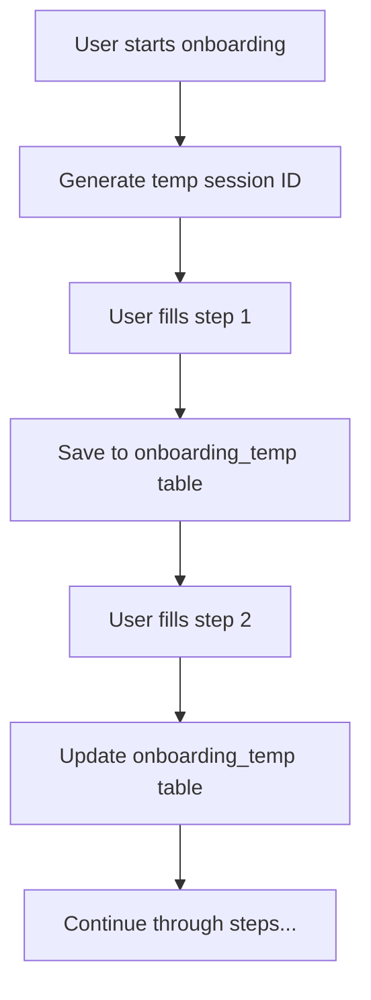
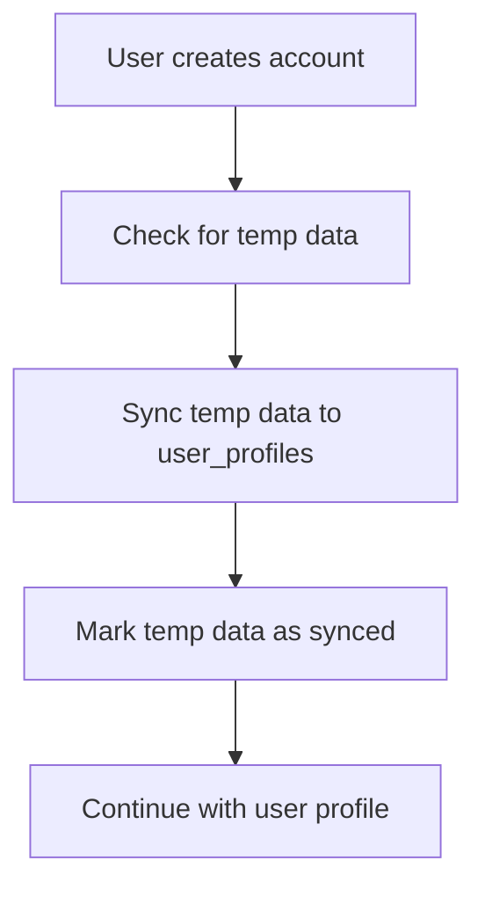

# Incremental Onboarding System

## Overview

The new incremental onboarding system solves the critical data loss issue by saving user profile data progressively as they complete each onboarding step, rather than waiting until the very end. This system works both before and after user authentication, ensuring no data is ever lost.

## Key Features

### ✅ Progressive Data Saving
- **Saves after each step**: Data is automatically saved to SQLite after every onboarding step
- **No data loss**: If the app crashes or user exits, their progress is preserved
- **Works offline**: All saving happens locally in SQLite, no network required

### ✅ Pre-Authentication Support
- **Works before login**: Users can complete onboarding before creating an account
- **Temporary storage**: Uses a temporary session ID to store data before authentication
- **Seamless sync**: Automatically syncs temp data to user profile once authenticated

### ✅ Robust Architecture
- **Automatic cleanup**: Old temporary sessions are cleaned up automatically
- **Error handling**: Comprehensive error handling with fallback mechanisms
- **Data integrity**: Validates and converts data formats properly

## How It Works

### 1. Temporary Storage Phase (Before Authentication)



### 2. Authentication & Sync Phase



### 3. Database Schema

#### New `onboarding_temp` Table
```sql
CREATE TABLE onboarding_temp (
    id INTEGER PRIMARY KEY AUTOINCREMENT,
    temp_session_id TEXT UNIQUE NOT NULL,
    profile_data TEXT NOT NULL,           -- JSON string of profile data
    current_step INTEGER NOT NULL DEFAULT 1,
    created_at TEXT NOT NULL DEFAULT (datetime('now')),
    updated_at TEXT NOT NULL DEFAULT (datetime('now')),
    firebase_uid TEXT,                    -- Set when user authenticates
    synced_to_profile INTEGER DEFAULT 0   -- 1 when synced to user_profiles
);
```

## Implementation Details

### Core Functions

#### `saveOnboardingProgressIncremental()`
```typescript
await saveOnboardingProgressIncremental(
    tempSessionId: string,
    profileData: UserProfile,
    currentStep: number,
    firebaseUid?: string
);
```
- Saves profile data incrementally
- Updates existing session or creates new one
- Works with or without authentication

#### `loadOnboardingProgressIncremental()`
```typescript
const data = await loadOnboardingProgressIncremental(tempSessionId);
// Returns: { profileData: UserProfile, currentStep: number } | null
```
- Loads saved progress from temporary storage
- Returns null if no data found

#### `syncTempOnboardingToUserProfile()`
```typescript
const success = await syncTempOnboardingToUserProfile(
    tempSessionId: string,
    firebaseUid: string,
    email: string
);
```
- Syncs temporary data to actual user profile
- Marks temp data as synced
- Creates user profile if it doesn't exist

### OnboardingContext Changes

The `OnboardingContext` has been completely rewritten to support incremental saving:

#### Key Changes:
1. **Added `tempSessionId` state** - Tracks the temporary session
2. **Modified `updateProfile()`** - Now saves data immediately
3. **Enhanced `goToNextStep()`** - Saves progress when advancing
4. **Improved `completeOnboarding()`** - Handles sync from temp data
5. **Better error handling** - Graceful degradation on failures

#### New Data Flow:
```typescript
// Before (problematic):
updateProfile() → setState() → wait until end → save all data

// After (robust):
updateProfile() → setState() → immediately save to SQLite → sync if authenticated
```

## Usage Guide

### For Onboarding Components

Components can now rely on automatic saving, but can also trigger manual saves:

```typescript
import { useOnboarding } from '../context/OnboardingContext';

const MyOnboardingStep = () => {
    const { updateProfile, saveOnboardingProgress } = useOnboarding();
    
    const handleDataChange = async (newData) => {
        // This automatically saves incrementally
        await updateProfile(newData);
        
        // Optional: manual save trigger
        await saveOnboardingProgress();
    };
};
```

### For Testing

Use the provided test script to verify the system:

```javascript
// In React Native debugger console:
testIncrementalOnboarding();
```

## Benefits

### 1. Data Persistence
- **No more lost progress**: Users can exit and return without losing data
- **App crash protection**: Data is saved continuously, not just at the end
- **Network independence**: Works completely offline

### 2. Better User Experience
- **Resume capability**: Users can start onboarding, exit, and resume later
- **Flexible authentication**: Can complete onboarding before or after sign-up
- **Progress indicators**: System knows exactly what data has been collected

### 3. Developer Benefits
- **Easier debugging**: Clear data trail and comprehensive logging
- **Reliable testing**: Can test individual steps without completing full flow
- **Maintenance**: Self-cleaning with automatic cleanup of old sessions

## Migration from Old System

### What Changed:
1. **`updateProfile()`** now saves immediately instead of just updating state
2. **`saveOnboardingProgress()`** now actually saves instead of being a no-op
3. **`goToNextStep()`** is now async and saves progress
4. **Data loading** now checks both user profile and temp storage

### Backward Compatibility:
- All existing onboarding components continue to work
- No changes needed to component interfaces
- Enhanced functionality is automatic

## Monitoring & Debugging

### Console Logs
The system provides comprehensive logging:
- `🆔` Temp session ID generation
- `✅` Successful incremental saves
- `🔄` Data sync operations
- `🗑️` Cleanup operations
- `❌` Error conditions

### Helper Functions
```typescript
import { logOnboardingProgress, hasMinimumProfileData } from '../utils/onboardingHelpers';

// Debug current state
logOnboardingProgress(profile, currentStep);

// Check if meaningful data exists
const hasData = hasMinimumProfileData(profile);
```

## Error Handling

### Graceful Degradation:
1. **Save failures**: Logged but don't break user experience
2. **Load failures**: Fall back to empty profile
3. **Sync failures**: Retry mechanisms and manual sync options

### Recovery Mechanisms:
- Automatic retry on temporary failures
- Manual sync triggers for edge cases
- Data validation and repair functions

## Performance Considerations

### Optimizations:
- **Debounced saves**: Automatic debouncing prevents excessive DB writes
- **JSON compression**: Profile data stored as optimized JSON
- **Cleanup scheduling**: Old sessions cleaned up automatically
- **Efficient queries**: Indexed lookups for fast retrieval

### Memory Usage:
- Minimal memory footprint (temp session ID + current profile)
- Automatic garbage collection of old temp data
- No large data structures held in memory

## Future Enhancements

### Planned Features:
1. **Step-level validation**: Validate data before saving each step
2. **Progress analytics**: Track completion rates and drop-off points
3. **Data migration**: Tools for migrating between onboarding versions
4. **Cloud backup**: Optional sync to cloud storage for cross-device continuity

### Configuration Options:
- Configurable cleanup intervals
- Adjustable retry policies
- Custom validation rules per step

## Troubleshooting

### Common Issues:

#### "No temp session ID"
```typescript
// Check if context is properly initialized
const { tempSessionId } = useOnboarding();
console.log('Session ID:', tempSessionId);
```

#### "Data not loading"
```typescript
// Check database initialization
import { ensureDatabaseReady } from '../utils/database';
await ensureDatabaseReady();
```

#### "Sync not working"
```typescript
// Manual sync trigger
import { syncTempOnboardingToUserProfile } from '../utils/database';
await syncTempOnboardingToUserProfile(sessionId, userId, email);
```

## Conclusion

The incremental onboarding system provides a robust, user-friendly solution to the data persistence problem. By saving progressively and supporting pre-authentication workflows, it ensures users never lose their progress while maintaining a smooth onboarding experience.

The system is designed to be:
- **Reliable**: Data is never lost
- **Flexible**: Works with any authentication flow
- **Maintainable**: Clear architecture and comprehensive logging
- **Performant**: Efficient database operations and cleanup

This implementation resolves the core issue while providing a foundation for future enhancements and improvements to the onboarding experience. 